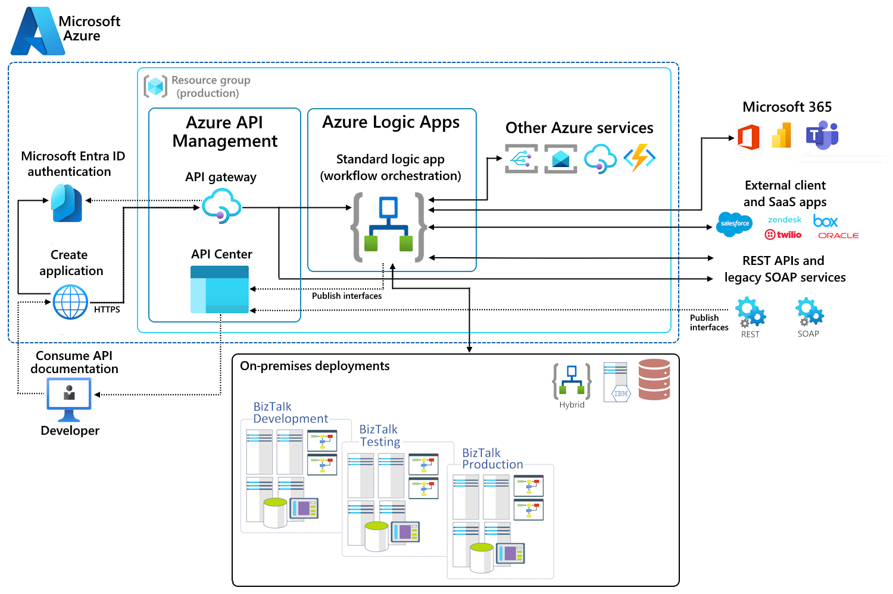

<!-- SEO: BizTalk migration to Azure, BizTalk end of life, BizTalk replacement,
     BizTalk to Logic Apps, BizTalk to Azure Integration Services, BizTalk Server
     end of support 2030, AIS accelerator, enterprise integration, B2B EDI Azure,
     BizTalk decommission, orchestration to Logic Apps, MessageBox to Service Bus,
     BizTalk modernization, cloud integration platform, Azure iPaaS -->

# AIS BizTalk Solution Accelerator

_Updated: March 4, 2026_

### Your fastest path from BizTalk Server to Azure Integration Services — a production-ready, one-click deployable foundation that provisions the core AIS services, maps every major BizTalk capability to its cloud-native equivalent, and gives your team a running start on migration day.

## Architecture overview

### BizTalk to Azure Integration Services Migration Architecture



The diagram above illustrates the target-state architecture for migrating BizTalk Server workloads to Azure Integration Services. On-premises BizTalk environments (Development, Testing, Production) are progressively replaced by cloud-native services within an Azure resource group: **Azure Logic Apps** (Standard) for workflow orchestration, **Azure API Management** as the API gateway secured by Microsoft Entra ID, and **API Center** for publishing and discovering integration interfaces. The platform connects to Microsoft 365, external SaaS applications (Salesforce, Zendesk, Twilio, etc.), and legacy REST/SOAP services — while hybrid connectivity bridges the gap during the migration period.

# Why this accelerator exists

### BizTalk Server end-of-support

Microsoft has announced that **BizTalk Server 2020 will be the final version of BizTalk, and will reach end of support in April 2030**. After that date, BizTalk Server will no longer receive feature updates, security updates, nor any technical support from Microsoft.

Even before April 2030, there are important dates to consider:

- End of support is set for January 2030 for SQL Server 2019.
- Service Bus Messaging Protocol (SBMP) will be retired Sept 30, 2026. Azure integrations after this date will require upgrading to Advanced Message Queuing Protocol (AMQP).
- BizTalk mainstream support will end April 2028, and Extended Support will need to be purchased for non-security hotfixes and support until April 2030.

There is no single product that will replace BizTalk; instead, the full suite of capability in Azure Integration Services (AIS) can provide equivalent functionality in a more modern, scalable, and secure way. Organizations that depend on BizTalk for B2B, EDI, EAI, and messaging workloads need to begin planning their migration paths now — not when the clock runs out and support is no longer available.

More information about the BizTalk lifecycle can be found at:
[Microsoft BizTalk Server Product Lifecycle Update | Microsoft Community Hub](https://techcommunity.microsoft.com/blog/integrationsonazureblog/microsoft-biztalk-server-product-lifecycle-update/4478559)

### Azure Integration Services: the cloud-native successor

**Azure Integration Services (AIS)** is Microsoft's cloud-native integration platform and the natural progression for BizTalk Server customers moving to Azure. AIS is not a single product — it's a suite of fully managed services that, together, replace and extend BizTalk's capabilities:

| BizTalk                                       | What it does                                                                                                                                                             | AIS Service Equivalent       |
| --------------------------------------------- | ------------------------------------------------------------------------------------------------------------------------------------------------------------------------ | ---------------------------- |
| Orchestrations, ports, pipelines              | Visual workflow orchestration with 1,000+ connectors. Available in Consumption (serverless, pay-per-execution) and Standard (dedicated, VNet-integrated) hosting models. | **Logic Apps**               |
| MessageBox, direct-bound ports                | Enterprise messaging with queues, topics, sessions, and dead-lettering.                                                                                                  | **Service Bus**              |
| SSO affiliate apps, binding-file secrets      | Centralised secret, key, and certificate management with auditing, RBAC, and managed-identity integration.                                                               | **Key Vault**                |
| FILE/FTP adapters, archive send ports         | ADLS Gen2 blob storage, Azure Files (SMB shares), and queue storage for message persistence and file-drop patterns.                                                      | **Azure Storage Account**    |
| BAM, HAT, SCOM health monitoring              | Unified monitoring workspace for diagnostic logs, KQL queries, dashboards, and alerts across all AIS resources.                                                          | **Log Analytics**            |
| Corporate network, firewall rules             | Network isolation with private DNS zones, ensuring service-to-service traffic stays off the public internet.                                                             | **VNet + Private Endpoints** |
| Custom pipeline components, helper assemblies | Serverless compute for custom code — complex transformations, data enrichment, protocol bridging, and any logic that exceeds a connector's built-in capabilities.        | **Azure Functions** _(opt)_  |
| BizTalk Admin Console, parties, maps, schemas | B2B hub for trading partners, agreements, schemas (XSD), and maps (XSLT/Liquid).                                                                                         | **Integration Account**      |

### What problems does AIS solve?

- **Infrastructure overhead** — BizTalk requires Windows Server VMs, SQL Server databases, SSO, and host instances. AIS is fully managed; there are no servers to patch or scale.
- **Scaling limitations** — BizTalk scales vertically (bigger VMs) or through manual host-instance configuration. Logic Apps (Consumption) scale automatically per-execution; Standard hosting supports scaling rules.
- **Connector ecosystem** — BizTalk adapters are finite and require custom development for new systems. Logic Apps provides 1,000+ managed connectors out of the box (SAP, Salesforce, Oracle, IBM MQ, file systems, and more).
- **Deployment agility** — BizTalk deployments involve MSI packages, binding files, and manual steps. AIS supports ARM/Bicep templates, CI/CD pipelines, and one-click deployment (see the button below).
- **Cost model** — BizTalk licensing is per-core. AIS offers pay-per-use (Consumption) or predictable hosting (Standard), allowing customers to right-size costs to actual workload volumes.

### EDI, HL7, and industry-standard message formats

One of BizTalk Server's strongest differentiators has always been its built-in support for **industry-standard message formats** — particularly **EDI** (X12, EDIFACT) for supply chain, logistics, and finance, and **HL7** (v2.x, FHIR) for healthcare. BizTalk ships with pre-built accelerators, schemas, pipelines, and party/agreement management that let organizations exchange regulated messages with trading partners out of the box.

These capabilities carry forward into Azure Integration Services:

| Format / Standard | BizTalk capability                                                         | AIS equivalent                                                                                                                                      |
| ----------------- | -------------------------------------------------------------------------- | --------------------------------------------------------------------------------------------------------------------------------------------------- |
| **X12 / EDIFACT** | EDI party agreements, schemas, batching, acknowledgements (997/CONTRL)     | **Integration Account** — supports X12 and EDIFACT agreements, schemas, batching, and functional/technical acknowledgements natively in Logic Apps. |
| **HL7 v2.x**      | BizTalk Accelerator for HL7 (BTAHL7) — parsing, validation, ACK generation | **Logic Apps HL7 connector** + Integration Account schemas — parses HL7 v2.x messages, validates segments, and generates ACK/NAK responses.         |
| **FHIR (HL7 v4)** | Custom pipelines or third-party adapters                                   | **Azure Health Data Services** (FHIR Server) + Logic Apps — cloud-native FHIR ingestion, validation, and exchange with full REST API support.       |
| **SWIFT / FIN**   | Custom pipeline components                                                 | **Azure Functions** or partner connectors for SWIFT message parsing and validation, called from Logic Apps workflows.                               |

For **healthcare** organizations, the combination of Logic Apps, Integration Account (HL7/FHIR schemas), and Azure Health Data Services provides a HIPAA-eligible, cloud-native replacement for BTAHL7 — with the added benefit of native FHIR support that BizTalk never offered. For **supply chain and B2B** customers, the Integration Account's EDI capabilities (agreements, batching, acknowledgements) map directly to BizTalk's EDI party management, making the migration path straightforward.

### Where this accelerator fits in

This repository provides a **ready-to-deploy baseline** that provisions core AIS services in a single click. It is designed to give BizTalk teams a hands-on starting point so they can:

1. **Explore** the AIS service landscape with real, deployed resources.
2. **Validate** integration patterns (receive → persist → queue → transform) against familiar BizTalk concepts.
3. **Extend** the baseline with their own schemas, maps, trading partners, and workflows.
4. **Estimate** costs using actual Azure meters before committing to a full migration plan.

## What this deploys

- Logic App (Consumption) **Hello World** workflow: HTTP POST accepts **XML**, writes to `xml-store`, sends message to Service Bus, returns 200.
- **Key Vault**: stores generated connection strings/keys as secrets (Storage key, Storage name, Service Bus connection string).
- Optional Integration Account + starter **Liquid map** (XML → JSON) and a sample **Liquid Logic App**.
- Service Bus namespace + `inbound` queue
- Storage Account (ADLS Gen2 enabled) + Blob container `xml-store` + Azure Files shares `drop` and `pickup`
- Log Analytics workspace
- Optional **Virtual Network** with pre-defined subnets (`snet-private-endpoints`, `snet-servicebus`, `snet-keyvault`, `snet-storage`) and optional DNS Private Resolver subnets
- Optional **Private Endpoints** for Service Bus, Storage (Blob + File), and Key Vault — placed in the `snet-private-endpoints` subnet with corresponding Private DNS Zones

---

# Resources deep dive

### Logic App (Consumption) — the heart of the accelerator

In BizTalk Server, an **Orchestration** is the central artefact: a compiled XLANG/s schedule that coordinates receive ports, send ports, maps, business rules, and exception handling inside a dehydratable state machine. Building even a simple "receive → transform → send" flow requires Visual Studio, a BizTalk project, strong-name signing, GAC deployment, binding files, and host-instance restarts.

**Logic Apps replace Orchestrations** — and much more. A single Logic App can:

| BizTalk concept                    | Logic App equivalent                                                                      |
| ---------------------------------- | ----------------------------------------------------------------------------------------- |
| Orchestration (XLANG/s)            | Workflow definition (ARM/Bicep JSON or designer canvas)                                   |
| Receive Port / Receive Location    | **Trigger** (HTTP, Service Bus, File, Timer, Event Grid, etc.)                            |
| Send Port / Send Port Group        | **Action** — any of the 1,000+ managed connectors                                         |
| Map (XSLT / functoids)             | **Transform XML/JSON** action + Integration Account maps (XSLT or Liquid)                 |
| Business Rules Engine (BRE)        | Condition / Switch / Until control-flow actions, or Azure Functions for complex rule sets |
| Promoted properties / context      | Tracked properties, `triggerBody()`, variables, and correlation tokens                    |
| Convoy / sequential convoy         | Service Bus sessions + peek-lock patterns                                                 |
| Dehydration / rehydration          | Built-in — Consumption Logic Apps automatically persist state between actions             |
| Exception handling (scope / catch) | **Scope** with `runAfter` conditions (`Failed`, `TimedOut`)                               |
| Compensation                       | Scope-based rollback logic with `runAfter: Failed` paths                                  |
| Correlation sets                   | Workflow-managed correlation via connector properties or tracked properties               |

### Service Bus — replacing the MessageBox

In BizTalk, the **MessageBox** (a SQL Server database) is the central publish-subscribe hub: every message passes through it, and subscriptions (filters) route messages to orchestrations and send ports. This is powerful but creates a SQL dependency, requires careful throttling, and is difficult to scale independently.

**Azure Service Bus** provides enterprise messaging without the database overhead:

- **Queues** act as point-to-point channels (like BizTalk direct-bound ports).
- **Topics + Subscriptions** enable publish-subscribe with SQL-like filter rules — conceptually identical to BizTalk MessageBox subscriptions, but fully managed and independently scalable.
- **Sessions** guarantee ordered, exactly-once processing — replacing BizTalk ordered delivery and sequential convoys.
- **Dead-letter queues** capture failed messages automatically, replacing BizTalk's suspended-instance model with an inspectable, replayable queue.

The accelerator creates a `Premium` namespace with queues and topics, giving you immediate messaging infrastructure with VNet integration, publish-subscribe, and the ability to receive, inspect, and replay messages.

### Storage Account (ADLS Gen2) — replacing file adapters and archive stores

BizTalk's **FILE adapter** and **FTP/SFTP adapters** write messages to disk or remote shares. Archive copies are handled by pipeline configuration or custom components. There is no built-in data-lake capability.

The accelerator provisions an **Azure Data Lake Storage Gen2** account with:

- A **Blob container** (`xml-store`) — the Hello World workflow writes received XML here, demonstrating the "archive a copy" pattern that BizTalk teams typically implement via a passthrough send port.
- **Azure Files shares** (`drop` and `pickup`) — SMB-mountable shares that replicate the familiar file-drop pattern. On-premises BizTalk FILE receive locations can be pointed at these shares (via Azure File Sync or VPN), enabling a gradual, side-by-side migration.
- **Hierarchical namespace** enabled — supporting folder-level ACLs for future data workloads.

### Key Vault — centralised secret management

BizTalk typically stores connection strings in **binding files** (XML), SSO affiliate applications, or custom config stores — all requiring manual management and often leading to secrets embedded in deployment packages.

**Azure Key Vault** provides:

- Centralised, audited storage for secrets, keys, and certificates.
- Managed identity integration — Logic Apps, Functions, and other AIS services retrieve secrets at runtime without storing credentials in code or config.
- Automatic rotation capabilities — replacing the manual key-rotation processes common in BizTalk environments.

The accelerator seeds Key Vault with the Storage key, Storage account name, and Service Bus connection string, demonstrating the recommended pattern for secret management in AIS.

### Integration Account — replacing BizTalk Admin Console artifacts

The BizTalk Admin Console manages **schemas** (XSD), **maps** (XSLT), **pipelines**, **trading partners**, **agreements**, and **certificates**. All of these are deployed via BizTalk Server and tightly coupled to the runtime.

The **Integration Account** is the AIS equivalent — a cloud-hosted repository for:

| Artefact type         | BizTalk equivalent                         | How the accelerator uses it                                                              |
| --------------------- | ------------------------------------------ | ---------------------------------------------------------------------------------------- |
| Schemas (XSD)         | BizTalk schemas                            | Upload via the `IntegrationAccountUploader` tool                                         |
| Maps (XSLT / Liquid)  | BizTalk maps (functoid-based XSLT)         | A starter `hello-xml-to-json.liquid` map is deployed and invoked by the Liquid Logic App |
| Partners & Agreements | BizTalk parties & agreements               | Not yet provisioned — ready for you to add your own B2B/EDI trading partners             |
| Certificates          | BizTalk certificates (signing, encryption) | Upload via Azure portal or ARM when you need AS2/X12 signing                             |

The Liquid map deployed with this accelerator transforms XML to JSON — a common BizTalk-to-AIS migration step, since many downstream systems prefer JSON while legacy sources still send XML.

### Azure Functions (optional) — custom code for transformations and operations

BizTalk Server relies heavily on **custom pipeline components**, **helper assemblies** (called from orchestrations via Expression shapes), and **.NET class libraries** for tasks that fall outside the built-in functoid and adapter capabilities — complex data transformations, database lookups for enrichment, checksum validation, proprietary protocol adapters, and business-rule evaluation. These components are compiled into DLLs, strong-name signed, GAC-deployed, and tightly coupled to the BizTalk runtime.

**Azure Functions** is the cloud-native replacement for all of that custom code. Functions are small, independently deployable units of compute that can be invoked from Logic Apps (via the Azure Functions connector) or triggered directly by Service Bus, HTTP, Timer, Event Grid, and more.

| BizTalk custom-code pattern                       | Azure Functions equivalent                                                                                                                                      |
| ------------------------------------------------- | --------------------------------------------------------------------------------------------------------------------------------------------------------------- |
| Custom pipeline component (IComponent)            | HTTP-triggered Function called as a Logic App action — receives the message, processes it, returns the result.                                                  |
| Helper .NET assembly in orchestration             | Function called from a Logic App workflow via the Azure Functions connector, keeping business logic separated and testable.                                     |
| Custom functoid (map extension)                   | Function that accepts input values, applies custom logic, and returns the transformed output — referenced from a Liquid/XSLT map or a Logic App Compose action. |
| BRE policy with .NET fact retriever               | Function that performs a database or API lookup, evaluates rules, and returns a decision — replacing the Business Rules Engine.                                 |
| Custom adapter (e.g., proprietary MQ, legacy ERP) | Function that bridges protocols — connects to the legacy system using its native SDK/API and exposes a clean HTTP or queue interface for Logic Apps.            |
| Scheduled SQL polling (SQL adapter receive)       | Timer-triggered Function that queries a database and pushes results to Service Bus or a Logic App HTTP trigger.                                                 |
| Checksum / hashing / encryption utilities         | Function that performs cryptographic operations on message payloads before or after transmission.                                                               |

#### Why Functions complement Logic Apps

Logic Apps excel at **orchestration** — connecting systems, routing messages, and managing long-running workflows visually. But when a step requires imperative, compute-heavy, or latency-sensitive code (e.g., parsing a complex flat file, calling a legacy COM API, or running a multi-step data-quality check), a Function is the right tool. The pattern is:

```
Logic App trigger ──▶ ... ──▶ Call Azure Function (custom transform) ──▶ ... ──▶ Send result
```

This mirrors how BizTalk orchestrations call helper assemblies or route through custom pipeline components — but without the GAC, strong naming, or host-instance restarts. Functions deploy in seconds, scale independently, and can be written in **C#, Python, JavaScript/TypeScript, Java, or PowerShell**.

#### Hosting options

| Plan            | Best for                                                                |
| --------------- | ----------------------------------------------------------------------- |
| **Consumption** | Sporadic, event-driven workloads — pay only when the function executes. |
| **Premium**     | VNet integration, pre-warmed instances, no cold-start — for production. |
| **Dedicated**   | Running on an existing App Service Plan alongside other web apps.       |

For this accelerator, the optional Function App uses the **Consumption** plan for simplicity. In production BizTalk migration scenarios, the **Premium** plan is recommended for VNet integration and predictable latency.

### Log Analytics — replacing BAM and health monitoring

BizTalk provides **Business Activity Monitoring (BAM)** for tracking, **Health and Activity Tracking (HAT)** for debugging, and **MOM / SCOM** integration for operational monitoring. These require separate databases, OLAP cubes, and portal configuration.

**Log Analytics** replaces all three with a single workspace:

- **Diagnostic logs** from every AIS resource (Logic App runs, Service Bus metrics, Key Vault access events) stream into one place.
- **KQL queries** let you build custom dashboards, replacing BAM views with far more flexibility.
- **Alerts** can be configured on any metric or log pattern, replacing SCOM-based health monitoring.

### Virtual Network (optional) — network isolation

BizTalk Server typically sits inside a corporate network, with firewall rules controlling access to adapters and endpoints. There is no built-in cloud networking — network segmentation is handled entirely outside BizTalk via Windows Firewall, corporate routers, and perimeter appliances.

**Azure Virtual Network (VNet)** brings that same isolation model into the cloud. When `deployVnet` is set to `true`, the accelerator provisions a `/22` VNet with purpose-built subnets:

| Subnet                      | Default CIDR    | Purpose                                                                                           |
| --------------------------- | --------------- | ------------------------------------------------------------------------------------------------- |
| `snet-private-endpoints`    | `10.0.0.0/27`   | Hosts Private Endpoints for Service Bus, Storage (Blob + File), and Key Vault.                    |
| `snet-servicebus`           | `10.0.0.64/26`  | Reserved for future Service Bus–integrated workloads (e.g., ASE, Functions with VNet injection).  |
| `snet-keyvault`             | `10.0.0.128/26` | Reserved for workloads that need direct Key Vault network rules.                                  |
| `snet-storage`              | `10.0.0.192/26` | Reserved for workloads that need direct Storage network rules.                                    |
| `snet-dns-inbound` _(opt)_  | `10.0.1.0/28`   | Azure DNS Private Resolver inbound endpoint — enables on-premises DNS forwarding into the VNet.   |
| `snet-dns-outbound` _(opt)_ | `10.0.1.16/28`  | Azure DNS Private Resolver outbound endpoint — enables conditional forwarding to on-premises DNS. |

The last two DNS subnets are deployed only when `deployDnsResolverSubnets` is `true`, supporting hybrid DNS resolution for organizations that need on-premises name resolution alongside Azure Private DNS.

#### Private Endpoints & Private DNS Zones

When the VNet is enabled, the accelerator also deploys **Private Endpoints** in the `snet-private-endpoints` subnet for:

- **Service Bus** (`privatelink.servicebus.windows.net`)
- **Storage — Blob** (`privatelink.blob.core.windows.net`)
- **Storage — File** (`privatelink.file.core.windows.net`)
- **Key Vault** (`privatelink.vaultcore.azure.net`)

Each Private Endpoint is paired with a **Private DNS Zone** and a **Virtual Network Link**, so that DNS queries from within the VNet resolve service FQDNs to the private IP addresses of the endpoints — not the public internet. This ensures all data-plane traffic between AIS resources stays on the Microsoft backbone.

#### Why this matters for BizTalk migrations

In regulated industries (finance, healthcare, government), BizTalk environments are typically air-gapped or heavily firewalled. Migrating to AIS without equivalent network controls is a non-starter. The VNet + Private Endpoints pattern gives security and compliance teams confidence that the cloud integration platform meets the same network-isolation requirements as the on-premises BizTalk infrastructure it replaces.

---

## Deploy to Azure

### Prerequisites

Before clicking the button below, ensure the following are in place:

- **Azure subscription** — you need an active Azure subscription. If you don't have one, [create a free account](https://azure.microsoft.com/free/).
- **Resource Group** — the template deploys into an existing Resource Group. Create one in the Azure portal or via CLI (`az group create`) before proceeding.
- **RBAC permissions** — the user clicking the button must have **Owner** or **Contributor** role assigned on the target Resource Group. Without one of these roles, the deployment will fail because it cannot create or configure resources.
- **Resource provider registrations** — the subscription must have the following resource providers registered: `Microsoft.Logic`, `Microsoft.ServiceBus`, `Microsoft.Storage`, `Microsoft.KeyVault`, `Microsoft.OperationalInsights`, and `Microsoft.Web`. Most subscriptions register these automatically on first use, but restricted subscriptions may require an administrator to register them manually.
- **Sufficient quota** — verify that the target region has available quota for the resources being deployed (e.g., storage accounts, Key Vault instances). Quota limits rarely block small deployments, but enterprise subscriptions with policies may enforce caps.

[](https://portal.azure.com/#create/Microsoft.Template/uri/https%3A%2F%2Fraw.githubusercontent.com%2Ftrajkovicn%2Fais-biztalk-solution-accelerator%2Fmain%2Finfra%2Farm%2Fazuredeploy.json/createUIDefinitionUri/https%3A%2F%2Fraw.githubusercontent.com%2Ftrajkovicn%2Fais-biztalk-solution-accelerator%2Fmain%2Finfra%2Farm%2FcreateUiDefinition.json)

---

## Cost comparison — BizTalk Server vs. Azure Integration Services

One of the most common questions during a BizTalk migration assessment is: **"How do the costs compare?"** Below is a T-shirt-sized estimate that maps a typical BizTalk on-premises footprint to an equivalent AIS deployment. These are _directional_ figures to guide planning — actual costs vary by region, licensing agreements, and workload volume.

### BizTalk Server (on-premises)

BizTalk costs are dominated by perpetual licences, Windows Server and SQL Server infrastructure, and the operational overhead of managing physical or virtual machines.

| Size       | Profile                                                                                         | Estimated annual cost |
| ---------- | ----------------------------------------------------------------------------------------------- | --------------------: |
| **Small**  | 1 BizTalk server (2 cores), 1 SQL Server Standard (2 cores), Windows Server, basic HA           |       **$40k – $60k** |
| **Medium** | 2 BizTalk servers (8 cores total), 1 SQL Server Enterprise (4 cores), clustered SQL, DR standby |     **$120k – $180k** |
| **Large**  | 4+ BizTalk servers (16+ cores), SQL Server Enterprise AG (8+ cores), multiple environments, SAN |     **$300k – $500k** |

_Includes: BizTalk licence per core, Windows Server licence, SQL Server licence, SA/support, hosting (power, rack, VM host), and 1–2 FTE operational overhead. Does not include application development costs._

### Azure Integration Services (cloud)

AIS costs shift from capex (licences + hardware) to opex (pay-as-you-go or reserved). There are no server licences, no OS patching, and no SQL infrastructure to manage.

| Size       | Profile                                                                                                                                 | Estimated annual cost |
| ---------- | --------------------------------------------------------------------------------------------------------------------------------------- | --------------------: |
| **Small**  | Logic Apps Consumption (~50k runs/mo), Service Bus Standard (1 namespace), Storage (50 GB), Key Vault, Log Analytics (5 GB/mo)          |         **$3k – $8k** |
| **Medium** | Logic Apps Standard (1 ASP), Service Bus Premium (1 MU), Integration Account Basic, Storage (500 GB), Key Vault, VNet, Log Analytics    |       **$30k – $60k** |
| **Large**  | Logic Apps Standard (multi-ASP), Service Bus Premium (4 MU), Integration Account Standard, Storage (2 TB+), VNet + PEs, APIM, Functions |      **$80k – $150k** |

_Includes: compute, messaging, storage, networking, and monitoring. Does not include Azure support plans or application development costs. Estimates based on East US pay-as-you-go pricing — reserved instances and Enterprise Agreement discounts can reduce costs further._

### Side-by-side summary

| Size       | BizTalk (annual) | AIS (annual) | Typical savings |
| ---------- | ---------------: | -----------: | :-------------- |
| **Small**  |      $40k – $60k |    $3k – $8k | ~80 – 90%       |
| **Medium** |    $120k – $180k |  $30k – $60k | ~60 – 75%       |
| **Large**  |    $300k – $500k | $80k – $150k | ~50 – 70%       |

> **Key takeaway:** Even at the _Large_ tier, AIS typically delivers **50–70% cost savings** over an equivalent BizTalk footprint — before factoring in reduced operational overhead (no OS patching, no SQL tuning, no host-instance management). The savings are most dramatic at the _Small_ tier, where BizTalk's per-core licensing creates a disproportionately high floor cost relative to the workload volume.
>
> Use the [Azure Pricing Calculator](https://azure.microsoft.com/pricing/calculator/) to model your specific workload.

## Further reading

- [BizTalk Server migration approaches — Microsoft Learn](https://learn.microsoft.com/en-us/azure/logic-apps/biztalk-server-migration-approaches)
