# Architecture

This accelerator deploys a DEV Azure Integration Services (AIS) baseline to begin BizTalk migrations.

## Architecture diagram

```mermaid
graph TB
    classDef azure fill:#0078D4,stroke:#005A9E,color:#fff,rx:8
    classDef optional fill:#50E6FF,stroke:#0078D4,color:#000,rx:8
    classDef network fill:#E8F5E9,stroke:#388E3C,color:#000,rx:8
    classDef external fill:#FFB900,stroke:#E68A00,color:#000,rx:8
    classDef storage fill:#773ADC,stroke:#5B2D99,color:#fff,rx:8

    Client["🌐 HTTP Client<br/>(curl / Postman / App)"]:::external

    subgraph RG["Azure Resource Group"]
        direction TB

        subgraph Core["Core Services"]
            direction LR
            LA_HW["⚡ Logic App<br/>Hello World<br/>(Consumption)"]:::azure
            LA_LQ["⚡ Logic App<br/>Liquid Transform<br/>(Consumption)"]:::optional
            SB["📨 Service Bus<br/>Standard Namespace<br/>• inbound queue"]:::azure
            KV["🔑 Key Vault<br/>• Storage key<br/>• Storage name<br/>• SB conn string"]:::azure
            LOG["📊 Log Analytics<br/>Workspace"]:::azure
        end

        subgraph Data["Storage (ADLS Gen2)"]
            direction LR
            BLOB["📦 Blob Container<br/>xml-store"]:::storage
            FILES_D["📁 File Share<br/>drop"]:::storage
            FILES_P["📁 File Share<br/>pickup"]:::storage
        end

        subgraph B2B["Integration Account (optional)"]
            direction LR
            IA["🗂️ Integration Account<br/>(Basic)"]:::optional
            MAP["🗺️ Liquid Map<br/>hello-xml-to-json"]:::optional
        end

        subgraph VNet["Virtual Network (optional)"]
            direction TB
            SNET_PE["snet-private-endpoints /27"]:::network
            SNET_SB["snet-servicebus /26"]:::network
            SNET_KV["snet-keyvault /26"]:::network
            SNET_ST["snet-storage /26"]:::network

            subgraph PE["Private Endpoints"]
                PE_SB["PE: Service Bus (namespace)"]:::network
                PE_BLOB["PE: Storage (blob)"]:::network
                PE_FILE["PE: Storage (file)"]:::network
                PE_KV["PE: Key Vault (vault)"]:::network
            end

            subgraph DNS["Private DNS Zones"]
                DNS_SB["privatelink.servicebus.windows.net"]:::network
                DNS_BLOB["privatelink.blob.core.windows.net"]:::network
                DNS_FILE["privatelink.file.core.windows.net"]:::network
                DNS_KV["privatelink.vaultcore.azure.net"]:::network
            end
        end
    end

    %% Data flow — Hello World
    Client -->|"POST XML"| LA_HW
    LA_HW -->|"Write blob<br/>hello-guid.xml"| BLOB
    LA_HW -->|"Send message<br/>+ CorrelationId"| SB
    LA_HW -->|"Read secrets<br/>at deploy time"| KV
    LA_HW -.->|"Diagnostic logs"| LOG

    %% Data flow — Liquid
    Client -->|"POST XML"| LA_LQ
    LA_LQ -->|"Transform<br/>XML → JSON"| MAP
    MAP --- IA

    %% Diagnostics
    SB -.->|"Metrics & logs"| LOG
    KV -.->|"Access logs"| LOG

    %% Private Endpoints wiring
    PE_SB ---|"private link"| SB
    PE_BLOB ---|"private link"| BLOB
    PE_FILE ---|"private link"| FILES_D
    PE_KV ---|"private link"| KV

    PE_SB --- DNS_SB
    PE_BLOB --- DNS_BLOB
    PE_FILE --- DNS_FILE
    PE_KV --- DNS_KV

    SNET_PE --- PE
```

### Colour key

| Colour        | Meaning                                                  |
| ------------- | -------------------------------------------------------- |
| 🟦 Blue       | Always-deployed core service                             |
| 🟦 Light blue | Optional service (Integration Account, Liquid Logic App) |
| 🟪 Purple     | Storage resources (Blob, File Shares)                    |
| 🟩 Green      | Networking (VNet, subnets, Private Endpoints, DNS Zones) |
| 🟨 Yellow     | External caller                                          |

### Data-flow summary

1. **Hello World path** — HTTP client POSTs XML → Logic App writes blob to `xml-store` → sends message to Service Bus `inbound` queue → returns 200 JSON.
2. **Liquid transform path** (optional) — HTTP client POSTs XML → Logic App calls Integration Account Liquid map → returns transformed JSON.
3. **Diagnostics** — Logic App run history, Service Bus metrics, and Key Vault access events stream to the shared Log Analytics workspace.
4. **Private networking** (optional) — when the VNet is deployed, Private Endpoints route Service Bus, Storage, and Key Vault traffic through the private network; Private DNS Zones ensure name resolution stays internal.

## Core resources

- Logic Apps (Consumption): Hello World XML ingress, plus optional Liquid sample.
- Service Bus: namespace + queues.
- Storage: ADLS Gen2 (HNS enabled) + blob container `xml-store` + file shares.
- Integration Account (optional): maps/schemas including Liquid maps.
- Key Vault: stores generated connection strings/keys as secrets for later use.
- Log Analytics workspace.
- Virtual Network (optional): subnets, Private Endpoints, and Private DNS Zones.
